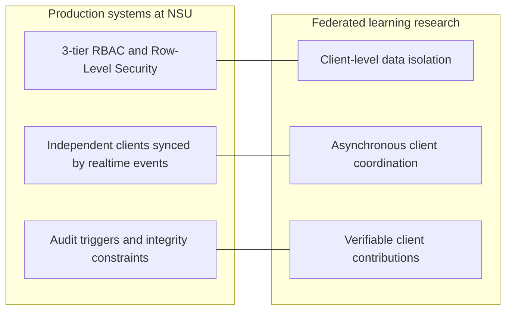
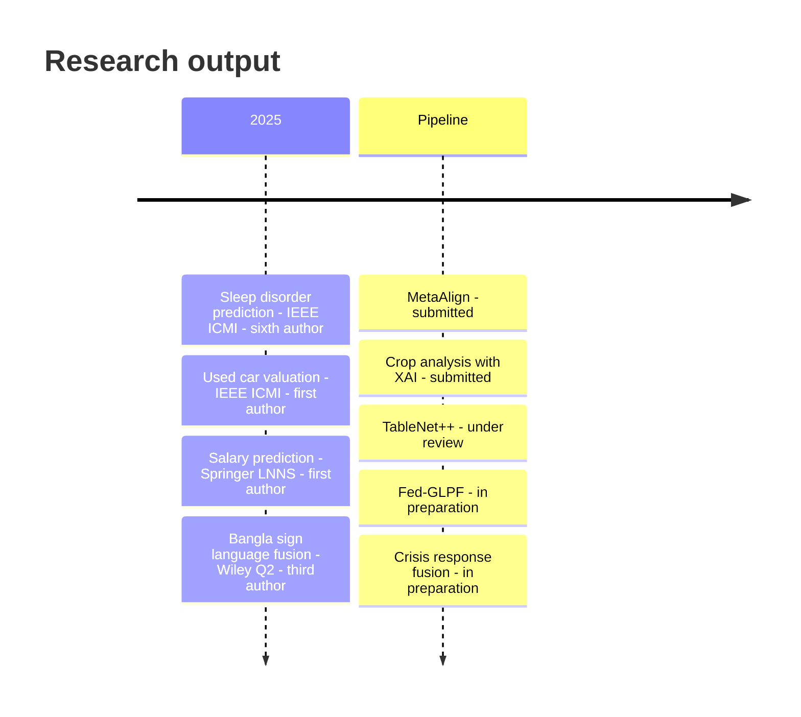
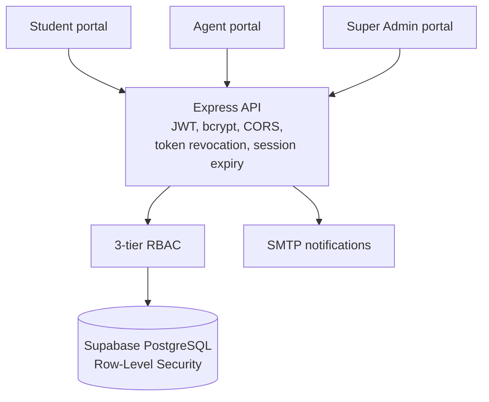
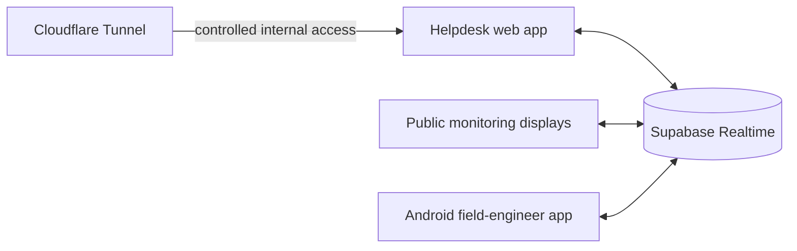

 

---

## Where to start

| If you are hiring | If you review PhD applications | If you want to collaborate |
|---|---|---|
| Start with [Systems Engineering](#systems-engineering). Four live production systems, with architecture diagrams and the numbers they run at. | Start with [Research](#research) and [Publications](#publications). Five first-author manuscripts, one clear thread. | Start with [Open questions](#open-questions-i-am-working-on), then [email me](mailto:abdullahpias09@gmail.com). |

Now: BSc CSE at North South University · IT Systems Assistant in the university's Office of IT · writing up federated and multimodal adaptation work · open to PhD positions and research collaborations.

---

## One idea behind both tracks

The systems I run at NSU and the learning problems I study share the same constraints: isolated clients, asynchronous updates, and contributions that must be verifiable.

---

## Research

**Interests:** federated and privacy-preserving learning · multimodal representation alignment · few-shot and cross-domain adaptation · evaluation that holds up under domain shift.

### Open questions I am working on

- How should a federated system align prototypes across clients whose modalities and domains differ?
- How little labeled data does a multimodal model need to adapt to a new domain?
- What does an evaluation protocol need to report so a result can be trusted (split, baselines, ablations)?

### First-author work

<table>
<tr>
<td width="50%" valign="top">

**[MetaAlign](REPO_OR_PAPER_URL)**
Prototype-centric multimodal alignment for few-shot adaptation.
*Submitted, FRUCT (40th Open Innovations Association).*

</td>
<td width="50%" valign="top">

**[Fed-GLPF](REPO_OR_PAPER_URL)**
Robust cross-domain few-shot diagnosis through hybrid multimodal prototype alignment.
*In preparation.*

</td>
</tr>
<tr>
<td width="50%" valign="top">

**[TableNet++](REPO_OR_PAPER_URL)**
Triple-branch table structure recognition.
*Under review, International Journal on Document Analysis and Recognition.*

</td>
<td width="50%" valign="top">

**[Crop Analysis with Explainable AI](REPO_OR_PAPER_URL)**
Crop prediction with machine learning and explanations.
*Submitted, FRUCT (40th Open Innovations Association).*

</td>
</tr>
<tr>
<td width="50%" valign="top">

**[TriFusionNet](https://github.com/almahmudpias/trifusionnet)**
Electricity demand prediction with transformer-based multimodal fusion and domain adaptation (DANN).
*PyTorch · code available.*

</td>
<td width="50%" valign="top">

**[Crisis Response Prediction](REPO_OR_PAPER_URL)**
Feature-level multimodal fusion for crisis response.
*In preparation.*

</td>
</tr>
</table>

<b>Collaborative research</b>

- **[Hands That Speak](https://github.com/almahmudpias/hands-that-speak)**: Bangla Sign Language recognition by late fusion of multimodal deep networks, 95%+ accuracy. Published in Engineering Reports (Wiley, Q2), 2025, as third author. My contribution: YOUR_CONTRIBUTION.
- **[Sleep Disorder Classification](https://ieeexplore.ieee.org/document/11141316)**: Bagging, SVM and Random Forest models, 92.4% accuracy. IEEE ICMI 2025, sixth author.

---

## Publications

### Published

| Year | Title | Venue | Author position | Links |
|---|---|---|---|---|
| 2025 | Optimizing Used Car Valuation with AI: A Predictive Modeling Approach | IEEE ICMI | **First** | [Paper](https://ieeexplore.ieee.org/abstract/document/11141166/) · [Code](REPO_URL) |
| 2025 | Predictive Modeling and Analysis of Software Engineer Salary Using Machine Learning | Springer LNNS (ETTIS) | **First** | [Paper](https://link.springer.com/chapter/10.1007/978-981-95-0684-2_4) · [Code](https://github.com/almahmudpias/Software-Engineer-Salary-Prediction) |
| 2025 | Bangla Sign Language Recognition With Multimodal Deep Learning Fusion | Engineering Reports, Wiley (Q2) | Third | [Paper](https://onlinelibrary.wiley.com/doi/abs/10.1002/eng2.70139) · [Code](https://github.com/almahmudpias/hands-that-speak) |
| 2025 | Sleep Disorder Prediction System Using Machine Learning | IEEE ICMI | Sixth | [Paper](https://ieeexplore.ieee.org/abstract/document/11141316/) |

### Submitted, under review, in preparation (first author and lead on all)

| Title | Venue | Status | Link |
|---|---|---|---|
| MetaAlign: Prototype-Centric Multimodal Alignment for Few-Shot Adaptation | FRUCT (40th Open Innovations Association) | Submitted | [Manuscript](https://drive.google.com/file/d/1J8WmKYmQFkRuH_a7Dj2bpma5NnDzxYkV/view?usp=sharing) |
| TableNet++: Triple-Branch Table Structure Recognition | IJDAR | Under review | [Manuscript](https://drive.google.com/file/d/13UuxzDm7BJpuJdULB0n8pRLRUi94KzjR/view?usp=drive_link) |
| Crop Analysis and Prediction Using Machine Learning with Explainable AI | FRUCT (40th Open Innovations Association) | Submitted | [Manuscript](https://drive.google.com/file/d/1qOJGQSLb810iFWZ7ZMqv9LqP6Pg-lMCh/view?usp=drive_link) |
| Fed-GLPF: Robust Cross-Domain Few-Shot Diagnosis via Hybrid Multimodal Prototype Alignment | to be decided | In preparation | [Draft](https://drive.google.com/file/d/1i3mJ3eDx0ofWN7Ai1HiwEAaW0B9g54tK/view?usp=sharing) |
| Multi-Modal Fusion Using Feature-Level Aggregation for Crisis Response Prediction | to be decided | In preparation | |

---

## Systems Engineering

IT Systems Assistant (part-time), Office of IT, North South University, Sept 2025 to present. Each system below is live and in daily use.

### NSU IT Support Center

`React/Vite` `Node.js` `Express` `Supabase` · **500+ tickets/day, 1,000+ at peak**

A multi-portal helpdesk for students, agents and super admins, with ticket-state management and automated SMTP notifications. Access control is layered: JWT, bcrypt, 3-tier RBAC, token revocation, session expiry, CORS and PostgreSQL Row-Level Security, so student records stay isolated across the whole ticket lifecycle. [Live](LIVE_URL) · [Repo](REPO_URL)

### NSU 1400 Helpdesk and Real-Time Monitoring

`Node.js` `React` `Android` `Supabase Realtime` `Cloudflare Tunnels` · **50+ tickets/day, 100+ at peak**

Independent clients update at different times, so the platform dispatches, synchronizes and reconciles ticket status across a helpdesk, public monitoring displays and an Android field-engineer app. Mobile notification and acknowledgement flows cut the time from ticket creation to assignment to resolution, and a workstation-support module tracks device intake and service state. Cloudflare Tunnels give controlled internal access without exposing campus endpoints. [Live](LIVE_URL) · [Repo](REPO_URL)

### NSU Enterprise IPAM

`PostgreSQL` `audit triggers` · **5,000+ IPs · 2,100+ devices · 1,800+ personnel records**

A live IP-management platform. Database-level integrity constraints and PostgreSQL audit triggers keep every record traceable and tamper-evident, and server-side filtered tables keep queries responsive at this size. [Repo](REPO_URL)

### NSU Online Portal

`Next.js` `Stripe` · **95+ Lighthouse under heavy concurrent load**

I led the redesign to server-side rendering and integrated secure Stripe payments. The portal covers course registration, payments and role-based access for NSU users. [Repo](https://github.com/almahmudpias/NSU-RDS)

### Freelance delivery

Two full-stack ERP systems, scoped and shipped independently for clients found through freelancing platforms:

- **Ecommerce seller platform:** full order lifecycle, COD settlement, returns, courier integration, variant-level inventory.
- **Enterprise ERP:** POS, inventory, procurement, multi-stakeholder P&L reporting, RBAC, CI/CD.

Portfolio available on request.

---

## Project archive

<b>AI and machine learning</b>

| Project | What it does | Stack |
|---|---|---|
| [Hands That Speak](https://github.com/almahmudpias/hands-that-speak) | Bangla Sign Language recognition with multimodal deep learning, 95%+ accuracy | TensorFlow · Keras · Python |
| [TriFusionNet](https://github.com/almahmudpias/trifusionnet) | Electricity demand prediction with transformer-based fusion and domain adaptation | PyTorch · DANN · Pandas |
| [Sleep Disorder Classification](https://ieeexplore.ieee.org/document/11141316) | Bagging, SVM and Random Forest models for sleep disorder detection, 92.4% accuracy (IEEE 2025) | Scikit-learn · Pandas |
| [Used Car Price Prediction](https://ieeexplore.ieee.org/document/11141166) | XGBoost regression with feature engineering and tuning, RMSE 0.240 (IEEE 2025) | XGBoost · Python |
| [Software Engineer Salary Prediction](https://github.com/almahmudpias/Software-Engineer-Salary-Prediction) | Flask app predicting salary from experience and skills, with GitHub Actions CI/CD | Flask · Python · GitHub Actions |

<b>Web platforms and full-stack systems</b>

| Project | What it does | Stack |
|---|---|---|
| [NSU Online Portal](https://github.com/almahmudpias/NSU-RDS) | Course registration, payments and role-based access for thousands of NSU users | PHP · MySQL, later Next.js · Stripe |
| [Dhaka Metro Ticketing System](https://github.com/almahmudpias/Metro-Rail-QR-Ticketing-System) | QR-based Metro Rail booking, digital tickets and secure payments | MERN · MongoDB · Node.js |
| [NSU IT Ticketing System](https://github.com/almahmudpias/NSU_IT_Helpdesk_Ticket) | Automated helpdesk ticket lifecycle with SLA-based prioritization and workflow testing | PHP · MySQL · Bootstrap |
| [Helpdesk Workflow System](https://github.com/almahmudpias/Helpdesk-Workflow-System) | Ticket lifecycle logic and notification testing for data integrity and fast resolution | PHP · MySQL |
| [Hayroo eCommerce](https://github.com/almahmudpias/Hayroo-Ecommerce) | Ecommerce platform with secure authentication, dashboards and optimized performance | React · Node.js · MongoDB |
| [Service Marketplace Platform](https://github.com/almahmudpias/Service-Marketplace-Platform) | Design and requirement analysis for job posting and bidding modules | Figma · Documentation |

<b>Quality assurance</b>

Testing is part of how I design systems, and it carries into my ML work as evaluation discipline.

| Project | Scope | Tools |
|---|---|---|
| [E-Commerce Platform QA (v1.1.2)](https://github.com/almahmudpias/ecommerce-qa-validation) | 40 test cases, 92.5% pass rate; 3 critical bugs found (checkout 500 error, authentication bypass, cart regression); defects tracked in Jira | Jira · Excel |
| [FinTech Payment Gateway, API and Security QA](REPO_URL) | 65 API test cases, 96% pass rate; security testing; JMeter load test at 450 TPS; Newman smoke suite; double-charge and JWT-expiry bugs found | Postman · Newman · JMeter |
| [SaaS HR System, End-to-End QA](REPO_URL) | 58 functional and 20 regression tests; payroll miscalculation and RBAC vulnerabilities found; Figma-vs-UI validation; API workflow tests; UAT checklist | Jira · Figma |
| [Testify, Manual Testing Suite](REPO_URL) | Test case design, bug reporting, and SOPs for test planning and defect tracking | Jira · Excel |

---

## Stack

  

  

  

Testing and tooling: Postman · Newman · JMeter · Selenium · Jira · TestRail · Figma

---

<picture>
  <source media="(prefers-color-scheme: dark)" srcset="https://raw.githubusercontent.com/almahmudpias/almahmudpias/output/github-snake-dark.svg"/>
  
</picture>

**Open to PhD positions and research collaborations in federated and multimodal learning.**
[Email](mailto:abdullahpias09@gmail.com) · [CV](CV_URL) · [Google Scholar](SCHOLAR_URL) · [Portfolio](https://almahmudpias.netlify.app)

