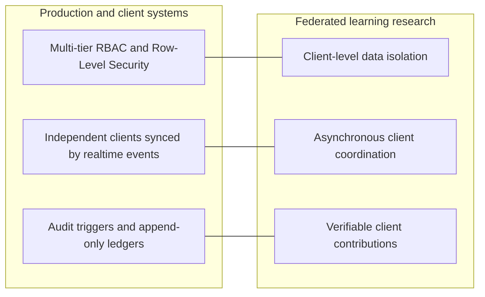
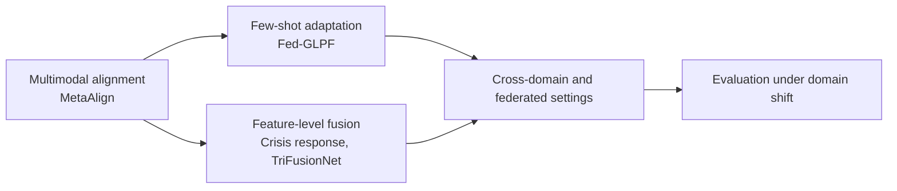
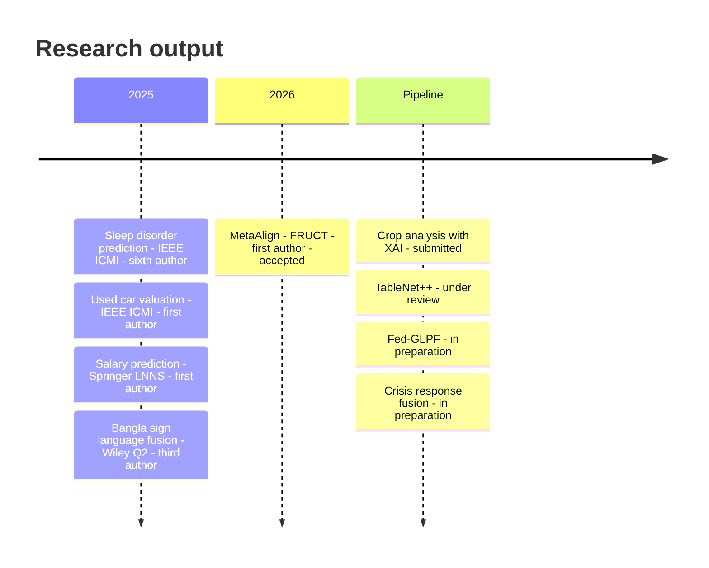
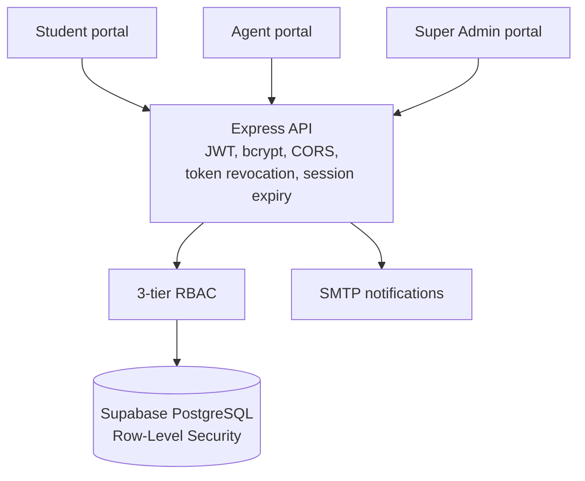
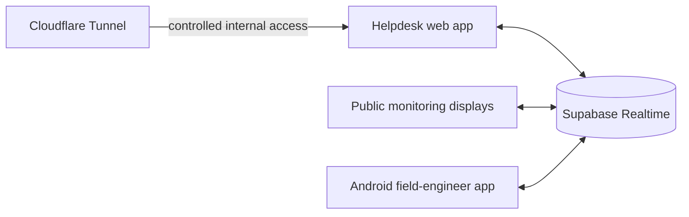
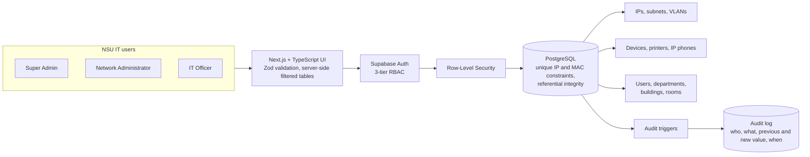
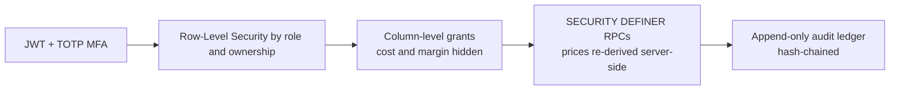
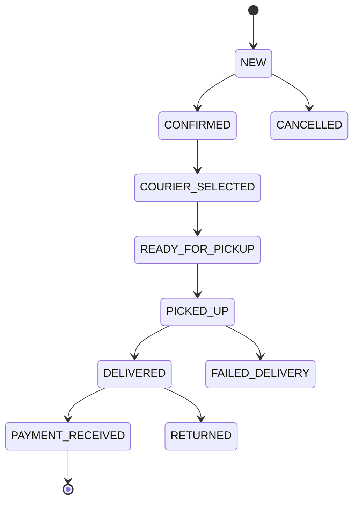

# 👋 Hi, I'm Md Abdullah Al Mahmud Pias  

> **Federated & Multimodal Learning Research · Production Systems Engineering**  
> *I build learning systems and software that keep working when data is isolated, clients are asynchronous, and every contribution has to be verifiable.*

```yaml
Focus    : Federated Adaptation · Privacy-Preserving Learning · Distributed Systems
Status   : Seeking PhD (Fall 2027) · IT Systems Assistant @ North South University
Papers   : 3 First-Author · 2 Co-Authored · 4 Pipeline
Systems  : Idempotency · Row-Level Security · Hash-Chained Ledgers · Distributed Sync
```
<div align="center">

[](https://almahmudpias.netlify.app)
[](https://scholar.google.com/citations?authuser=1&user=FLzxgCYAAAAJ)
[](https://orcid.org/0009-0007-9005-5003)
[](https://www.researchgate.net/profile/YOUR_RG_NAME)
[](https://drive.google.com/file/d/1Jq_PrEvfIfz28goiRi6ozCJNqgKUF0a5/view?usp=drive_link)
[](https://linkedin.com/in/almahmudpias)
[](mailto:abdullahpias09@gmail.com)

</div>
---

## Where to start

| If you are hiring | If you review PhD applications | If you want to collaborate |
|---|---|---|
| Start with [Problems I have solved](#problems-i-have-solved). Each one is a real constraint, the design that handled it, and the result. Then see the [engineering patterns](#engineering-patterns-i-reach-for). | Start with [Research](#research) and [Publications](#publications). Three accepted first-author papers, four first-author manuscripts in the pipeline, one thread: alignment under isolation. | Start with [Open questions](#open-questions-i-am-working-on), then [email me](mailto:abdullahpias09@gmail.com). |

Now: BSc CSE at North South University · IT Systems Assistant in the university's Office of IT · writing up federated and multimodal adaptation work · open to PhD positions and research collaborations.

---

## One idea behind both tracks

The systems I run and the learning problems I study share the same constraints: isolated clients, asynchronous updates, and contributions that must be verifiable.



---

## Research

**Interests:** federated and privacy-preserving learning · multimodal representation alignment · few-shot and cross-domain adaptation · evaluation that holds up under domain shift.

### Open questions I am working on

- How should a federated system align prototypes across clients whose modalities and domains differ?
- How little labeled data does a multimodal model need to adapt to a new domain?
- What does an evaluation protocol need to report so a result can be trusted (split, baselines, ablations)?

### How the work connects



### First-author work

<table>
<tr>
<td width="50%" valign="top">

**[MetaAlign](https://drive.google.com/file/d/1J8WmKYmQFkRuH_a7Dj2bpma5NnDzxYkV/view?usp=drive_link)**
Prototype-centric multimodal alignment for few-shot adaptation.
*Accepted, FRUCT (40th Open Innovations Association).*

</td>
<td width="50%" valign="top">

**[Fed-GLPF](https://drive.google.com/file/d/1Tz8AV4cob7PjlK7ot0pbgwn5pVezEp47/view?usp=drive_link)**
Robust cross-domain few-shot diagnosis through hybrid multimodal prototype alignment.
*In preparation.*

</td>
</tr>
<tr>
<td width="50%" valign="top">

**[TableNet++](https://drive.google.com/file/d/13UuxzDm7BJpuJdULB0n8pRLRUi94KzjR/view?usp=drive_link)**
Triple-branch table structure recognition.
*Under review, International Journal on Document Analysis and Recognition.*

</td>
<td width="50%" valign="top">

**[Crop Analysis with Explainable AI](https://drive.google.com/file/d/1qOJGQSLb810iFWZ7ZMqv9LqP6Pg-lMCh/view?usp=drive_link)**
Crop prediction with machine learning and explanations.
*Submitted, FRUCT (40th Open Innovations Association).*

</td>
</tr>
<tr>
<td width="50%" valign="top">

**[TriFusionNet](https://github.com/almahmudpias/trifusionnet)**
Electricity demand prediction with transformer-based multimodal fusion and domain adaptation (DANN).
*PyTorch · code available.*

</td>
<td width="50%" valign="top">

**Crisis Response Prediction**
Feature-level multimodal fusion for crisis response.
*In preparation.*

</td>
</tr>
</table>

### Collaborative research

- **[Hands That Speak](https://github.com/almahmudpias/hands-that-speak)**: Bangla Sign Language recognition by late fusion of multimodal deep networks, 95%+ accuracy. Engineering Reports (Wiley, Q2), 2025, third author. [Paper](https://onlinelibrary.wiley.com/doi/10.1002/eng2.70139)
- **[Sleep Disorder Classification](https://ieeexplore.ieee.org/document/11141316)**: Bagging, SVM and Random Forest models, 92.4% accuracy. IEEE ICMI 2025, sixth author.

---

## Publications

### Published

| Year | Title | Venue | Author position | Links |
|---|---|---|---|---|
| 2026 | MetaAlign: Prototype-Centric Multimodal Alignment for Few-Shot Adaptation | FRUCT (40th Open Innovations Association) | **First** | [Manuscript](https://drive.google.com/file/d/1J8WmKYmQFkRuH_a7Dj2bpma5NnDzxYkV/view?usp=drive_link) |
| 2025 | Optimizing Used Car Valuation with AI: A Predictive Modeling Approach | IEEE ICMI | **First** | [Paper](https://ieeexplore.ieee.org/abstract/document/11141166/) |
| 2025 | Predictive Modeling and Analysis of Software Engineer Salary Using Machine Learning | Springer LNNS (ETTIS) | **First** | [Paper](https://link.springer.com/chapter/10.1007/978-981-95-0684-2_4) · [Code](https://github.com/almahmudpias/Software-Engineer-Salary-Prediction) |
| 2025 | Bangla Sign Language Recognition With Multimodal Deep Learning Fusion | Engineering Reports, Wiley (Q2) | Third | [Paper](https://onlinelibrary.wiley.com/doi/10.1002/eng2.70139) · [Code](https://github.com/almahmudpias/hands-that-speak) |
| 2025 | Sleep Disorder Prediction System Using Machine Learning | IEEE ICMI | Sixth | [Paper](https://ieeexplore.ieee.org/abstract/document/11141316/) |

### Submitted, under review, in preparation (first author and lead on all)

| Title | Venue | Status | Link |
|---|---|---|---|
| TableNet++: Triple-Branch Table Structure Recognition | IJDAR | Under review | [Manuscript](https://drive.google.com/file/d/13UuxzDm7BJpuJdULB0n8pRLRUi94KzjR/view?usp=drive_link) |
| Crop Analysis and Prediction Using Machine Learning with Explainable AI | FRUCT (40th Open Innovations Association) | Submitted | [Manuscript](https://drive.google.com/file/d/1qOJGQSLb810iFWZ7ZMqv9LqP6Pg-lMCh/view?usp=drive_link) |
| Fed-GLPF: Robust Cross-Domain Few-Shot Diagnosis via Hybrid Multimodal Prototype Alignment | To be decided | In preparation | [Draft](https://drive.google.com/file/d/1Tz8AV4cob7PjlK7ot0pbgwn5pVezEp47/view?usp=drive_link) |
| Multi-Modal Fusion Using Feature-Level Aggregation for Crisis Response Prediction | To be decided | In preparation | |



---

## Problems I have solved

A selection from the [project archive](#project-archive). Each entry follows the same shape: the problem, the constraint that made it hard, what I built, and the result.

### [NSU IT Support Center](https://github.com/almahmudpias/NSU_IT_Support_Center)

`React/Vite` `Node.js` `Express` `Supabase` · **500+ tickets/day, 1,000+ at peak** · [Repo](https://github.com/almahmudpias/NSU_IT_Support_Center)

**Problem:** a university helpdesk where students, agents and admins share one system, and one student must never see another student's records.
**Built:** a multi-portal helpdesk with ticket-state management and SMTP notifications. Isolation is enforced in layers: JWT, bcrypt, 3-tier RBAC, token revocation, session expiry, CORS and PostgreSQL Row-Level Security, so the database protects data even if an application layer fails.



### [NSU 1400 Helpdesk and Real-Time Monitoring](https://github.com/almahmudpias/nsu_helpdesk_1400)

`Node.js` `React` `Android` `Supabase Realtime` `Cloudflare Tunnels` · **50+ tickets/day, 100+ at peak** · [Repo](https://github.com/almahmudpias/nsu_helpdesk_1400)

**Problem:** field engineers, a desk team and public displays all act on the same ticket at different times, and slow assignment hurts resolution time.
**Built:** a platform that dispatches, synchronizes and reconciles ticket status across a helpdesk, public monitoring displays and an Android field-engineer app. Mobile notification and acknowledgement flows shorten the path from creation to assignment to resolution. A workstation-support module tracks device intake and service state. Cloudflare Tunnels give controlled internal access without exposing campus endpoints.



### [NSU Enterprise IPAM](https://github.com/almahmudpias/NSU-Enterprise-IPAM)

`PostgreSQL` `audit triggers` · **5,000+ IPs · 2,100+ devices · 1,800+ personnel records** · [Repo](http://github.com/almahmudpias/NSU-Enterprise-IPAM)

**Problem:** network records at this scale go stale, and nobody can prove who changed what.
**Built:** a live IP-management platform. Database-level integrity constraints and PostgreSQL audit triggers keep every record traceable and tamper-evident. Server-side filtered tables keep queries responsive at this size.



### [NSU Online Portal](https://github.com/almahmudpias/NSU-RDS)

`Next.js` `Stripe` · **95+ Lighthouse under heavy concurrent load**

**Problem:** course registration brings thousands of students at once, and the original PHP and MySQL portal was not built for that peak.
**Built:** I led the redesign to server-side rendering and integrated secure Stripe payments, with role-based access for NSU users. [Repo](https://github.com/almahmudpias/NSU-RDS)

### ExpotextBD ERP

`React 18` `Supabase` `PostgreSQL RLS` `Tailwind` `Vercel` · Client project, proprietary source

**Problem:** a business with several partners and staff online at once needs POS, inventory, procurement and a profit pipeline where sales staff never see cost or margin, and nobody can quietly rewrite money history.
**Built:** an ERP covering POS, inventory, purchasing, expenses and a stockholder-aware P&L module. Net profit flows into a percentage split, then personal withdrawals, then a 3-way handover approval with idempotency keys. The key decisions:

- **Cost and margin are hidden at the database**, using column-level grants and a `products_public` view for the sales role, not just UI filtering.
- **Checkout re-derives every price server-side** inside a `SECURITY DEFINER` RPC, so client-side price or discount tampering has no effect.
- **Audit and handover records are append-only.** A hash chain on the audit log allows offline tamper detection, and the handover ledger has no UPDATE or DELETE for any role, including admin.
- **Admin access requires TOTP MFA**, and login abuse is limited by rate limits, CAPTCHA and constant-time username lookup.



### Seller ERP for Bangladesh ecommerce sellers

`React 18` `Supabase` `PostgreSQL` `Tailwind` `Vercel` · Client project, proprietary source

**Problem:** sellers take orders from Facebook, WhatsApp and phone, mostly on COD, and run on spreadsheets. Stock double-sells, COD goes untracked, and returns overwrite the original sale, so nobody can say what they actually made this month.
**Built:** a full operations workspace for orders, inventory, purchases, couriers, returns and finance. The key decisions:

- **Oversell protection:** stock reservation runs inside a database transaction with a PostgreSQL advisory lock and an atomic balance check, backed by an immutable inventory-movement ledger.
- **Accounting-safe returns:** a return attaches to the original order and never rewrites it. Gross sale, refund and net sales stay separate, and stock changes go through typed movements (`RETURN_RESTOCK`, `RETURN_DAMAGED`, exchange in and out) instead of silent overwrites.
- **A deterministic order state machine:** every transition is validated and logged with actor and timestamp, across the path from new order to payment received and the exception paths.
- **Isolated third-party calls:** courier and payment-gateway integrations go through a transactional outbox with retry and backoff, so external latency cannot stall core database transactions.
- **Zero-trust security:** RLS on every table, server-side role checks, column-level protection against role escalation, TOTP MFA for admins, and provisioned-only accounts.



*Source for both ERPs is private client work. A walkthrough is available on request.*

---

## Engineering patterns I reach for

The same few ideas recur across the systems above and the research.

| Pattern | The problem it solves | Where I used it |
|---|---|---|
| Defense in depth with Row-Level Security | A bug in one layer must not leak another user's data | NSU IT Support Center, ExpotextBD ERP, Seller ERP |
| Server-side re-derivation of money and stock | Clients cannot be trusted with prices or quantities | ExpotextBD checkout RPC |
| Append-only ledgers and audit triggers | History must be traceable and corrections visible | NSU IPAM, ExpotextBD, Seller ERP |
| Advisory locks plus immutable movements | Concurrent writers must not oversell inventory | Seller ERP |
| Deterministic state machines | Illegal state transitions must be impossible | Seller ERP orders, NSU helpdesk tickets |
| Realtime sync with reconciliation | Independent clients update at different times | NSU 1400 Helpdesk |
| Outbox with retry and backoff | Slow external APIs must not stall core transactions | Seller ERP |
| Evaluation under domain shift | A result is only trustworthy if the protocol is | MetaAlign, Fed-GLPF, TriFusionNet |

---

## Project archive

### AI and machine learning

| Project | What it does | Stack |
|---|---|---|
| [Hands That Speak](https://github.com/almahmudpias/hands-that-speak) | Bangla Sign Language recognition with multimodal deep learning, 95%+ accuracy | TensorFlow · Keras · Python |
| [TriFusionNet](https://github.com/almahmudpias/trifusionnet) | Electricity demand prediction with transformer-based fusion and domain adaptation | PyTorch · DANN · Pandas |
| [Sleep Disorder Classification](https://ieeexplore.ieee.org/document/11141316) | Bagging, SVM and Random Forest models for sleep disorder detection, 92.4% accuracy (IEEE 2025) | Scikit-learn · Pandas |
| [Used Car Price Prediction](https://ieeexplore.ieee.org/document/11141166) | XGBoost regression with feature engineering and tuning, RMSE 0.240 (IEEE 2025) | XGBoost · Python |
| [Software Engineer Salary Prediction](https://github.com/almahmudpias/Software-Engineer-Salary-Prediction) | Flask app predicting salary from experience and skills, with GitHub Actions CI/CD | Flask · Python · GitHub Actions |

### Web platforms and full-stack systems

| Project | What it does | Stack |
|---|---|---|
| ExpotextBD ERP | POS, inventory, procurement and stockholder-aware P&L with hardened RLS and MFA (client project) | React · Supabase · Tailwind |
| Seller ERP | Orders, COD, couriers, returns, inventory locking and finance for ecommerce sellers (client project) | React · Supabase · PostgreSQL |
| [NSU Online Portal](https://github.com/almahmudpias/NSU-RDS) | Course registration, payments and role-based access for thousands of NSU users | PHP · MySQL, later Next.js · Stripe |
| [Dhaka Metro Ticketing System](https://github.com/almahmudpias/Metro-Rail-QR-Ticketing-System) | QR-based Metro Rail booking, digital tickets and secure payments | MERN · MongoDB · Node.js |
| [NSU IT Ticketing System](https://github.com/almahmudpias/IT_Ticketing_System) | Automated helpdesk ticket lifecycle with SLA-based prioritization and workflow testing | PHP · MySQL · Bootstrap |
| [Helpdesk Workflow System](https://github.com/almahmudpias/Helpdesk-Workflow-System) | Ticket lifecycle logic and notification testing for data integrity and fast resolution | PHP · MySQL |
| [Hayroo eCommerce](https://github.com/almahmudpias/Hayroo-Ecommerce) | Ecommerce platform with secure authentication, dashboards and optimized performance | React · Node.js · MongoDB |
| [Service Marketplace Platform](https://github.com/almahmudpias/Service-Marketplace-Platform) | Design and requirement analysis for job posting and bidding modules | Figma · Documentation |

### Quality assurance

Testing is part of how I design systems, and it carries into my ML work as evaluation discipline.

| Project | Scope | Tools |
|---|---|---|
| [E-Commerce Platform QA (v1.1.2)](https://github.com/almahmudpias/ecommerce-qa-validation) | 40 test cases, 92.5% pass rate; 3 critical bugs found (checkout 500 error, authentication bypass, cart regression); defects tracked in Jira | Jira · Excel |
| FinTech Payment Gateway, API and Security QA | 65 API test cases, 96% pass rate; security testing; JMeter load test at 450 TPS; Newman smoke suite; double-charge and JWT-expiry bugs found | Postman · Newman · JMeter |
| SaaS HR System, End-to-End QA | 58 functional and 20 regression tests; payroll miscalculation and RBAC vulnerabilities found; Figma-vs-UI validation; API workflow tests; UAT checklist | Jira · Figma |
| Testify, Manual Testing Suite | Test case design, bug reporting, and SOPs for test planning and defect tracking | Jira · Excel |

---

## Stack

<p>
  
</p>
<p>
  
</p>
<p>
  
</p>
<p>
  
</p>

**Research tooling:** PyTorch · TensorFlow · Scikit-learn · LaTeX · reproducible evaluation splits
**Testing and tooling:** Postman · Newman · JMeter · Selenium · Jira · TestRail · Figma

---

<div align="center">

[Email](mailto:abdullahpias09@gmail.com) · [CV](https://drive.google.com/file/d/1Jq_PrEvfIfz28goiRi6ozCJNqgKUF0a5/view?usp=drive_link) · [Google Scholar](https://scholar.google.com/citations?authuser=1&user=FLzxgCYAAAAJ) · [ORCID](https://orcid.org/0009-0007-9005-5003) · [Portfolio](https://almahmudpias.netlify.app)

</div>
